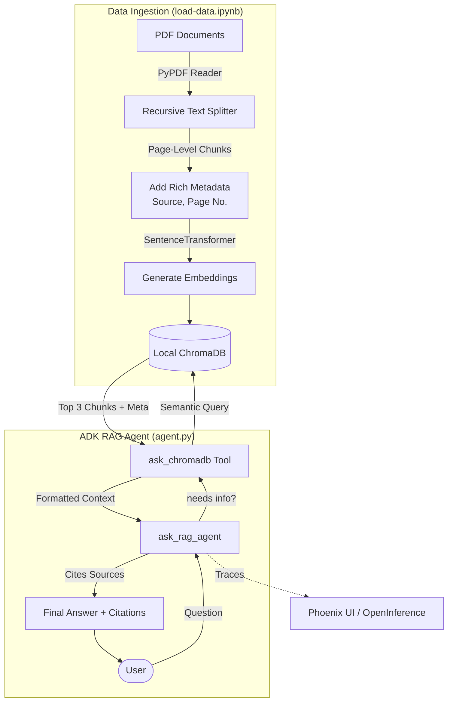

# RAG (Retrieval-Augmented Generation) Agent Architecture

This directory contains an ADK-powered RAG agent setup, complete with data processing notebooks, a persistent vector database, and evaluation scripts. The agent is built to accurately answer questions based on a specific knowledge corpus (like financial 10-K reports) using rigorous source citation.

## High-Level Architecture



## Directory Structure

*   **`notebooks/`**: Contains Jupyter notebooks for processing data.
    *   **`load-data.ipynb`**: The vital data ingestion script. It reads a PDF document **page by page**, splits the text into overlapping chunks using `RecursiveCharacterTextSplitter`, and embeds them into a local ChromaDB collection using `all-MiniLM-L6-v2`. Importantly, it attaches rich metadata (source filename, page number, character offsets) to *every* chunk. This page-level granularity ensures the RAG agent can accurately cite exactly where it found the information.
    *   **`analyze-data.ipynb`**: A notebook designed for exploratory data analysis of the indexed chunks.
*   **`rag_agent/`**: The core ADK module.
    *   **`agent.py`**: Defines the `ask_rag_agent` ADK instance running a local model like `gpt-oss:20b` (via `LiteLlm` and Ollama). It also instruments the run to Phoenix for tracing observability.
    *   **`prompts.py`**: Provides rigorous instructions to the agent on when to use the retrieval tool and how to strictly align answers with the context, including mandatory citation formatting (e.g., "Source: [title] (Page Number: [X])").
    *   **`tools.py`**: Exports the `ask_chromadb` ADK tool, which queries the persistent ChromaDB collection initialized by the notebooks.
    *   **`tracing.py`**: Contains the OpenInference integration for Phoenix UI telemetry.
*   **`chroma_db_chunks/`**: The persistent local vector database directory generated automatically by the ingest notebook.
*   **`eval/`**: Contains evaluation and continuous testing scripts (such as `test_eval_phoenix.py`) used to benchmark the RAG agent's retrieval precision and response quality over standard datasets.

## Getting Started

1.  **Start Phoenix UI (Optional but recommended for tracing)**
    ```bash
    uv run phoenix serve
    ```
    
2.  **Preload the Data**
    Before querying the agent, you must populate the vector database. Open and run the cells inside `notebooks/load-data.ipynb` to parse your PDFs and build the ChromaDB store.

3.  **Run the Agent**
    Once the database is populated, use the ADK CLI to chat with the RAG agent:
    ```bash
    uv run adk web RAG/rag_agent
    ```
