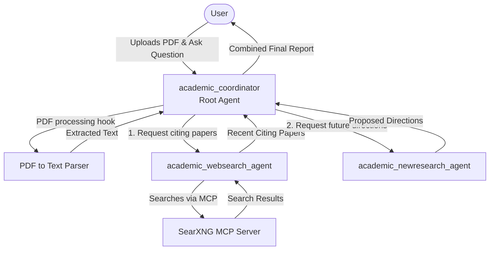

# Academic Research Local

An ADK workflow designed to streamline the academic research process by analyzing a provided seminal paper, discovering newer related literature via intelligent web search, and synthesizing future research directions based on findings. This agent functions entirely locally using Ollama and an MCP tool pointing to SearXNG.

## Architecture



The system uses a hierarchical agent pattern through the main `academic_coordinator` agent, which acts as the main interface for the user and delegates tasks to specialized sub-agents.

### Core Components

* **`academic_coordinator`**:
  The root agent. It first analyzes an input PDF (which represents a seminal paper) that is attached to its session. It summarizes the paper, extracts its abstract, key concepts, and original citations. Then, it sequentially invokes sub-agents to analyze the recent impact of the paper and proposes future research directions.

  * *Note on PDFs*: To allow the local Ollama LLM to properly digest the document, this agent registers a `before_model_callback` hook (`intercept_and_parse_pdf` in `agent.py`) which processes any attached PDF parts via `pypdf`, converts them directly to text, and swaps them dynamically into the payload before reaching the LLM.
* **`academic_websearch_agent`** (Sub-agent):
  Responsible for looking up recent publications that cite the seminal paper. It uses the `seaxng_mcp` tool (`SearXNG` standard search interface bound to the Model Context Protocol stdio transport layer) to query web/academic sources for papers published within the last 1-2 years. It tries increasingly diverse querying strategies until it meets quotas.
* **`academic_newresearch_agent`** (Sub-agent):
  Synthesizes the summary of the seminal paper and the recent citing papers retrieved by the web search agent. It generates a comprehensive list of novel future research directions spanning different focuses (e.g., high potential utility, unexpectedness, and popular trend-alignment).

## Prerequisites

1. **Ollama**: Install and run Ollama pointing to locally served models.
2. **SearXNG**: Install/configure your SearXNG backend for the MCP server queries.
3. **Python Dependencies**: Ensure `uv` environment with `google-adk`, `pypdf`, `litellm`, and `mcp` installed.

## Usage

You can test this agent via the ADK Web UI by directing it to the CLI:

```bash
uv run adk web academic_research
```

Once the web UI starts (usually at `http://127.0.0.1:8000`), upload a `.pdf` of an academic paper of your choosing, and ask the agent to summarize it, find recent citing papers, and formulate research directions. The ADK pipeline will automatically parse the PDF into text and execute the multi-agent orchestration.
